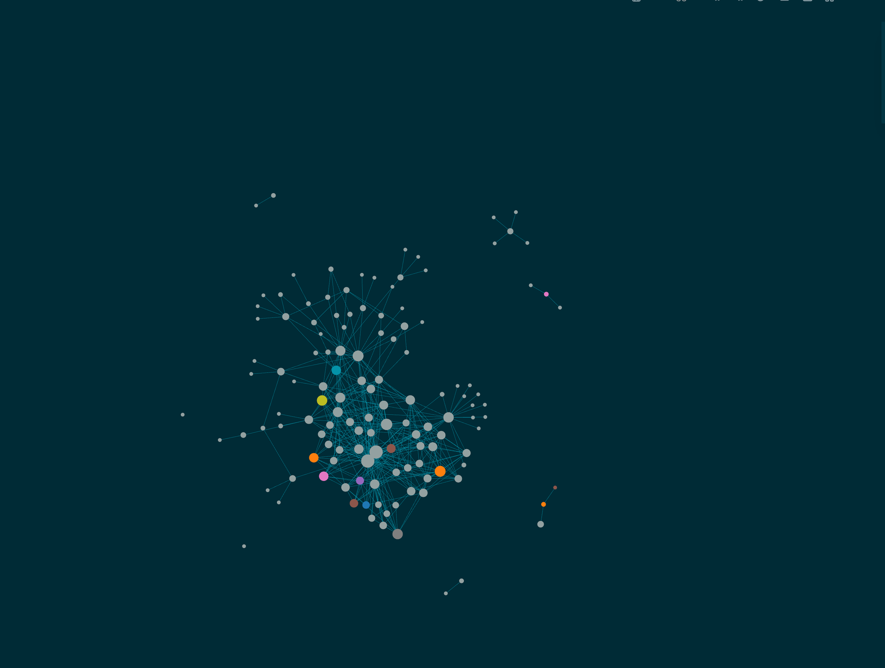

# llm-wiki

[](LICENSE)
[](https://github.com/larnsce/llm-wiki/commits)

Build [Karpathy's LLM Wiki](https://gist.github.com/karpathy/442a6bf555914893e9891c11519de94f) with Claude Code: a suite of eight skills that maintain a structured, cross-referenced knowledge base in Logseq or Obsidian, on a two-layer cache architecture (L1/L2) with a source-provenance and trust layer.

## What is this?


*Your wiki after a few ingests: interconnected knowledge pages in Logseq's graph view.*

In April 2026, Andrej Karpathy published a gist called "LLM Wiki". The idea: let an LLM maintain a structured, cross-referenced wiki for you. Feed it raw sources, it extracts facts, links them together, and keeps everything consistent. The wiki becomes a persistent, compounding artifact instead of a graveyard of stale notes.

llm-wiki is an implementation of that idea. Claude Code is the LLM brain; Logseq or Obsidian is the wiki UI. Version 2 replaces the original single `/wiki` command with a suite of focused skills backed by a spec canon (`openspec/specs/`), shared scripts, and a mechanical test harness. For how the design compares against the original gist, in both directions, see [docs/design-vs-karpathy.md](docs/design-vs-karpathy.md).

## The skill suite

| Skill | What it does |
|-------|--------------|
| `wiki-setup` | Initialize or upgrade a wiki: config discovery and validation, fresh scaffolding, legacy v1 detection, Schema-page upgrade |
| `wiki-ingest` | The write path: process a source (URL, file, text, or the `raw/` queue), update pages append-only with provenance; interactive by default, `--auto` for queue draining, `--import` for existing notes |
| `wiki-query` | The read path: two-stage retrieval via hub indexes, targeted page reads, Access-Log update, synthesized answer with sources |
| `wiki-lint` | Two-layer health check: mechanical rules via `lint.py` and `check_canon.py`, judgment rules on top; fixes only with confirmation |
| `wiki-maintain` | Status report (read-only metrics, hot/cold cache profile) and prune (LRU-Demote eviction of cold pages from the live index) |
| `wiki-migrate` | One-time, interactive corpus migrations driving `migrate_wiki.py`: the v1-to-v2 schema pass and the lowercase rename pass (`Wiki/` to `wiki/`, `--lowercase`) |
| `wiki-audit` | Verify a page claim by claim against its cited sources (one isolated subagent per source); read-only by default, `--fix` writes only after confirmation |
| `wiki-update` | The sanctioned non-append edit path for cited content: diff-first, source-required; superseded claims stay legible |
| `wiki-glossary` | The glossary curation loop (v2.3): drain `#glossary-todo` captures into one checkpoint, promote staging rows, pull-only termbase import; every write is human-confirmed, the tool never decides a Rule |
| `wiki-ingest-voice` | Personal tier (v3.0, `--with-personal` only): drain unprocessed voice transcripts from archive.db to journal summaries; wiki writes per-row opt-in, interactive only |
| `wiki-chat-voice` | Personal tier (issue #117, `--with-personal` only): a conversation with your recorded voice notes - browse the archive (read-only, runtime digests), talk about selected notes in-session, close with one confirmed ingest: journal synthesis by default, per-claim wiki offers citing the note ids |

`skills/wiki-core/` is not a skill; it is the shared library the suite runs on: the scripts (`init_wiki.py`, `lint.py`, `check_canon.py`, `secret_scan.py`, `migrate_wiki.py`, config discovery) and the shared reference docs (config, architecture, formats, trust).

## Install

```bash
git clone https://github.com/larnsce/llm-wiki.git
cd llm-wiki
./setup.sh
```

`setup.sh` copies (or, with `--symlink`, links) the skills into `~/.claude/skills/` (or `<project>/.claude/skills/` with `--project`) and the `agents/` subagent definitions into `~/.claude/agents/` (model-tier routing, see [docs/model-tiering.md](docs/model-tiering.md); skills fall back to generic subagents without them), optionally scaffolds a wiki via `init_wiki.py` (`--init --tool logseq --wiki-path ~/notes`, with `--with-para-notes` and `--with-glossary` for the human layers), and optionally writes a global pointer file so the skills find your wiki from any directory. It patches no files; config is discovered at runtime. Run `./setup.sh --help` for all options.

Requirements: bash, python3, git. No npm, no pip.

## Quickstart

```
/wiki-setup                        # scaffold or validate the wiki
/wiki-ingest "your first source"   # write path: source -> pages
/wiki-query "what do I know about X?"
/wiki-lint                         # health check, fixes on confirmation
/wiki-maintain                     # status report; "prune" to evict cold pages
```

The wiki starts sparse and gets denser with every ingest. Ingest is interactive by default: it presents a consolidated plan (pages to create and update, reliability ratings) and waits for your approval before writing anything.

## The personal tier (v3.0)

The repo ships a personal pipeline beside the generic tool, behind an explicit opt-in (`setup.sh --with-personal`); the default install never includes it. It is built for one concrete setup (macOS, whisper.cpp, a phone that syncs voice memos) and the repo documents it rather than fully shipping it:

- **Storage planes** (`openspec/specs/storage.md`): markdown is what a human writes; SQLite is what a machine accumulates. `archive.db` (raw capture, irreplaceable, backed up, never in git) and `index.db` (derived from the vault by `rebuild_index.py`, disposable, rebuilt any time) are never merged.
- **Voice pipeline** (`docs/voice-pipeline.md` + `/wiki-ingest-voice`): phone memo to whisper.cpp transcript to a journal summary with provenance (`archive.db:voice_notes/<id>`). Journal-only by default; anything touching a wiki page or naming a person is confirmed per row; assessments of people never leave the transcript.
- **Two-plane query**: aggregate, temporal, and full-text questions route to `index.db` SQL (FTS5, stdlib sqlite3) with a staleness check before every read; entity questions stay on pages. Every answer names its plane.
- **Archive layer** (`docs/archive-layer.md`): Google Takeout (mail, calendar, contacts) into archive.db, documented copy-paste importers, lazy alias resolution.

Zero external dependencies still holds: sqlite3 and FTS5 come with python3.

## Support tiering

- **Logseq is tier-1.** It is the mode the maintainer uses daily; the outliner format is what the ingest write discipline was designed around.
- **Obsidian is experimental.** The scripts and the test harness exercise obsidian mode mechanically (scaffolding, lint, fixtures), but no CI currently instantiates a real Obsidian vault and diffs the rendered output. Treat obsidian mode as functional but less proven until that gate exists.

## The L1/L2 architecture

Some knowledge must be available in every session, before you ask a question ("always use ISO 8601 dates"). If the LLM has to query the wiki to learn these rules, it has already made the mistake. Other knowledge only matters in specific contexts, and loading it every session wastes the context window. The design maps onto a CPU cache hierarchy:

| Layer | What | Loading | Contains |
|-------|------|---------|----------|
| **L1** | Claude Code Memory (~10-20 files) | Auto-loaded every session | Rules, gotchas, identity, credentials |
| **L2** | Wiki (~50-200 pages) | On demand via `/wiki-query` | Projects, workflows, research, deep knowledge |

The routing rule: would a mistake without this knowledge be dangerous or embarrassing? L1. Merely inconvenient? L2. Credentials must live in L1: the wiki is git-tracked, the L1 memory directory is not.

Two cache mechanisms keep L2 precise as it grows:

- **Hub-index routing.** Every hub page carries an `### Index` of routing lines (`[[page]] -- description #tags`). Query reads the cheap indexes first, picks the best 3-5 pages, and reads only those; full-text grep is the L3 fallback. Every full-page read lands in an append-only Access-Log together with the reason it was picked.
- **LRU-Demote.** `/wiki-maintain prune` evicts pages with no access in N months (default 6) from the live index. Eviction is not deletion: the file stays, links stay valid, and the page is re-promoted on a re-hit.

For the deep-dive, see [docs/l1-l2-architecture.md](docs/l1-l2-architecture.md).

## Source provenance and trust

With the source pipeline configured, ingest is reproducible: a source dropped in `raw/` is synthesized into pages, then moved to `ingested/<type>/` in the same git commit as the page edits. The move is the provenance record. Pages carry `source-file::` (which file they rest on) and `reliability:: high | medium | low` (how good the sources are; the page takes the minimum across its claims). Weakly-supported pages get a `## Pending Review` section until corroborated. `reliability::` and `confidence::` (is this current and verified) are separate axes and never cross-derived.

Before any source file is archived into the git-tracked `ingested/` tree, a pre-archive secret gate (`secret_scan.py`) scans its bytes for credential patterns; blocking findings stop the move. Source types listed in `sensitive_source_types` never enter git history at all.

## The schema

The schema is the contract between you and the LLM: page types (Entity, Project, Knowledge, Feedback, Hub) with required properties, namespaces, lint rules, and the provenance conventions. Pages are stamped with `schema-spec-version::` so lint can distinguish a v2 page from a grandfathered v1 page. The canonical rules live in `openspec/specs/`, mirrored into the vault's Schema page by the templates; `check_canon.py` keeps those surfaces from drifting. See [docs/schema-reference.md](docs/schema-reference.md).

## Migrating from v1

- **From the single `/wiki` command:** see [docs/migration-v2.md](docs/migration-v2.md). The legacy `.claude/commands/wiki.md` file keeps working but is unsupported; `wiki-setup` detects it and offers removal.
- **An existing pre-v2 page corpus:** see [docs/migration.md](docs/migration.md). Lint grandfathers unmigrated pages by default; `wiki-migrate` drives the one-time converter.

## Testing

`bash skills/wiki-core/scripts/test_pipeline.sh` runs the mechanical harness (both tool modes, fixtures generated at runtime), golden transcripts in `tests/golden/` pin the LLM-side behaviors, and [docs/testing.md](docs/testing.md) describes the manual end-to-end protocol.

## Documentation

- [FAQ](docs/faq.md) - Common questions before you run `setup.sh`
- [Troubleshooting](docs/troubleshooting.md) - Setup, integration, and runtime issues
- [L1/L2 Architecture](docs/l1-l2-architecture.md) - Why two layers, how to route knowledge
- [Schema Reference](docs/schema-reference.md) - Page types, properties, lint rules
- [Logseq vs. Obsidian](docs/logseq-vs-obsidian.md) - Detailed comparison and migration notes
- [Design vs. the Karpathy gist](docs/design-vs-karpathy.md) - What the gist wanted, what v2 restores, what this tool adds
- [Migration from v1 (command)](docs/migration-v2.md) - Single command to skill suite
- [Migration from v1 (corpus)](docs/migration.md) - Grandfather mode and the converter
- [Testing](docs/testing.md) - Harness, golden transcripts, manual protocol
- [Source Routes](docs/source-routes.md) - Every source kind, its capture mechanism, pipeline entry, and trust/model-tier defaults; includes the manual AI-transcript protocol
- [Model Tiering](docs/model-tiering.md) - Route wiki work by task value: tier map, the four agents, escalation triggers, run-log observability, review checklist
- [Website](docs/website.md) - How the documentation site builds and publishes (Quarto, generated reference indexes, GitHub Pages)
- [Literature Research](docs/literature-research.md) - Pipeline (Connected Papers, Semantic Scholar, Elicit, Zotero) and how the wiki skills fit
- [Firefox Web-Clipper](docs/web-clipper-firefox.md) - Clip web pages into the `raw/` queue with MarkDownload on macOS
- [PARA + Zettelkasten workflow](docs/para-notes-workflow.md) - Run `para/` and `notes/` in the same graph; the promotion seam into `wiki/`
- [Tasks-sync workflow](docs/tasks-sync-workflow.md) - GitHub Issues as canonical task state: journal/`para/` TODOs to issues via `/tasks-sync`, closed issues back as `DONE`
- [Zotero setup](docs/zotero-setup.md) - Wire Zotero so literature notes are born as `notes/literature/@citekey`
- [Roadmap: v2.2](docs/roadmap-v2.2-para-notes-zotero.md) - The para/notes/Zotero assessment and issue breakdown

## Credits

- Inspired by [Andrej Karpathy's LLM Wiki gist](https://gist.github.com/karpathy/442a6bf555914893e9891c11519de94f)
- Built with [Claude Code](https://claude.ai/code)
- Works with [Logseq](https://logseq.com/) and [Obsidian](https://obsidian.md/)

## License

MIT - see [LICENSE](LICENSE) for details.
