# The L1/L2 Architecture

This is the part that is not in Karpathy's gist, and it turned out to be the most important design decision in the entire system.

## The Discovery

When you first start building an LLM wiki, the plan seems simple: put everything in one place. All your project notes, coding rules, deployment gotchas, personal preferences -- one system to rule them all.

It takes about a day to realize this is wrong.

Some knowledge must be available in *every single session*, before you even ask a question. Things like "always use ISO 8601 date format" or "max 2-3 SSH calls to the server, never 10+, or you risk an OOM reboot." If the LLM has to query the wiki to learn these rules, it has already made the mistake. The damage is done by the time the knowledge is retrieved.

Other knowledge only matters in specific contexts. The full history of a blog series. The detailed API publishing workflow. The evaluation of a marketing strategy. Loading all of this into every session would waste the context window and slow things down.

You need two layers. The solution maps to a concept every engineer knows.

## The CPU Cache Metaphor

In a CPU, L1 cache is tiny but blazing fast -- data the processor needs on every cycle. L2 cache is larger but slower -- data that is important but not needed constantly. Main memory is huge but comparatively glacial.

The same principle applies to LLM knowledge:

| | CPU Cache | LLM Wiki |
|---|-----------|----------|
| **L1** | ~64 KB, 1 cycle latency | ~10-20 files, auto-loaded every session |
| **L2** | ~256 KB, 10 cycle latency | ~50-200 pages, queried on demand |
| **Main memory** | GBs, 100+ cycle latency | The internet, your email, Confluence, Jira |

```mermaid
graph TB
    subgraph "L1 — Claude Code Memory (auto-loaded)"
        L1R[Rules & Gotchas<br/><i>Max 3 SSH calls, date format, etc.</i>]
        L1I[Identity & Preferences<br/><i>Name, address, communication style</i>]
        L1C[Credentials & Secrets<br/><i>API tokens, passwords — git-excluded</i>]
    end

    subgraph "L2 — Wiki (on-demand)"
        L2P[Projects & History<br/><i>Timelines, decisions, status</i>]
        L2W[Workflows & Processes<br/><i>Publishing, deployment, onboarding</i>]
        L2K[Research & Learning<br/><i>Tech evaluations, book notes, courses</i>]
        L2B[Business Intelligence<br/><i>Client details, strategy, market analysis</i>]
    end

    subgraph "Main Memory — External Sources"
        EXT1[Email / Slack]
        EXT2[Jira / Confluence]
        EXT3[The Internet]
    end

    CLAUDE[Claude Code Session] -->|Always has| L1R
    CLAUDE -->|Always has| L1I
    CLAUDE -->|Always has| L1C
    CLAUDE -->|/wiki-query| L2P
    CLAUDE -->|/wiki-query| L2W
    CLAUDE -->|/wiki-query| L2K
    CLAUDE -->|/wiki-query| L2B
    CLAUDE -->|/wiki-ingest| EXT1
    CLAUDE -->|/wiki-ingest| EXT2
    CLAUDE -->|/wiki-ingest| EXT3
```



## The Routing Rule

When new knowledge comes in, how do you decide where it goes? The rule is simple:

**Would the LLM making a mistake without this knowledge be dangerous or embarrassing?** Then it belongs in **L1** -- auto-loaded every session, zero-query latency.

**Would the mistake be merely inconvenient?** Then it belongs in **L2** -- queried on demand when the context requires it.

Some examples:

| Knowledge | Consequence of not knowing | Layer |
|-----------|---------------------------|-------|
| "Always use ISO 8601 dates" | Inconsistent dates across all output | **L1** |
| "Server has 2GB RAM, max 3 SSH calls" | OOM reboot in production | **L1** |
| "Business address changed to X" | Wrong address on proposals | **L1** |
| "Deploy script requires clean git state" | Failed deploys, wasted time | **L1** |
| "Blog series has 3 published parts" | Inaccurate count, easily corrected | **L2** |
| "Evaluated 4 marketing strategies in Q1" | Missing context, ask to clarify | **L2** |
| "Book outline has 12 chapters" | Wrong chapter count, quickly fixable | **L2** |
| "Client project started 2025-06-01" | Incorrect timeline, no real harm | **L2** |

The pattern is clear: L1 holds *operational guardrails* -- things that prevent mistakes in the moment. L2 holds *contextual knowledge* -- things that enrich answers when relevant.

## Credential Safety

Credentials deserve special attention because they sit at the intersection of two constraints:

1. **They must be in L1** because the LLM needs them without querying (e.g., API tokens for deployment scripts).
2. **They must never be in L2** because the wiki is typically git-tracked.

This is not just a preference -- it is a hard security boundary. The L1 memory directory lives at a path like `~/.claude/memory/` which is excluded from version control via `.gitignore`. The L2 wiki lives in your Logseq or Obsidian graph, which you likely sync or commit to a repository.

The lint rule `credential-leak` exists to enforce this boundary. It scans all wiki pages for patterns like `token::`, `password::`, `secret::`, and `api-key::`. If it finds a match, it flags it as a critical issue.

```
credential_patterns:
  - "token::"
  - "password::"
  - "secret::"
  - "api.key::"
  - "api-key::"
  - "[A-Za-z0-9+/]{40,}"   # Base64 strings that look like tokens
```

The rule is absolute: **if it is a secret, it goes in L1. Period.**

## L1 in Practice: Claude Code Memory

In Claude Code, L1 maps to two mechanisms:

1. **`CLAUDE.md`** -- A project-level instruction file loaded automatically at session start. Contains high-level project context, tech stack, and links to skills.
2. **`memory/` directory** -- Persistent memory files that Claude Code loads every session. Each file covers one topic: a gotcha, a preference, a credential reference.

A typical L1 memory directory looks like this:

```
memory/
  MEMORY.md              # Index file — points to L2 wiki for deep queries
  feedback_deploy_ram.md # "Stop X before deploy to prevent OOM"
  feedback_ssh_batch.md  # "Max 2-3 SSH calls, never 10+"
  user_name.md           # Name spelling and preferences
  user_address.md        # Current business address
  reference_creds.md     # API tokens and passwords (git-excluded!)
```

The total size is small -- typically under 20 files, each a few lines. This is deliberate. L1 should be scannable in a fraction of a second. If your L1 grows past ~30 files, it is time to audit and move contextual knowledge to L2.

## L2 in Practice: The Wiki

L2 is the wiki itself -- dozens to hundreds of structured pages organized by namespace. Unlike L1, these pages are only loaded when relevant. A `/wiki-query "what is the status of project X?"` triggers Claude to read 3-5 relevant pages, not all 100.

The key properties of L2:

- **Structured**: Every page follows the schema (required properties, page types, cross-references).
- **Searchable**: Namespaces and properties make it easy for the LLM to find relevant pages.
- **Append-only**: New information is added to existing pages, never overwriting what is already there.
- **Versioned**: Every change is git-committed with a description of what was ingested.

## The L1/L2 Boundary in the Schema

The schema explicitly defines the boundary so the system can self-enforce it:

```markdown
## L1/L2 Boundary
- L1 (Memory): Rules, gotchas, identity, credentials
- L2 (Wiki): Projects, workflows, research, deep knowledge
- Same info in both? → Lint warning
```

This is not just documentation -- the `/wiki-lint` command actively checks for L1/L2 duplicates. If the same rule appears in both a memory file and a wiki page, it flags a warning. Duplicates mean one copy will eventually go stale, leading to contradictory knowledge.

## Evolving the Boundary

The L1/L2 boundary is not static. As your wiki grows, some knowledge migrates:

- **L2 to L1**: You discover a lesson the hard way three times. Time to promote it from "project context" to "always-loaded rule."
- **L1 to L2**: A credential is rotated and the old one is removed. The history of why it was rotated is L2 material.
- **Merge**: Two L1 files cover related gotchas. Combine them into one to keep L1 lean.
- **Archive**: A project completes. Its L1 gotchas become L2 historical notes.

The `/wiki-lint` command helps with this evolution by flagging anomalies: L1 files that have not been referenced in 90 days, L2 pages that get queried in every session (suggesting they should be L1), and duplicates that need resolution.

The goal is a lean L1 and a rich L2. Keep the fast cache small and hot. Let the wiki grow without bounds.
