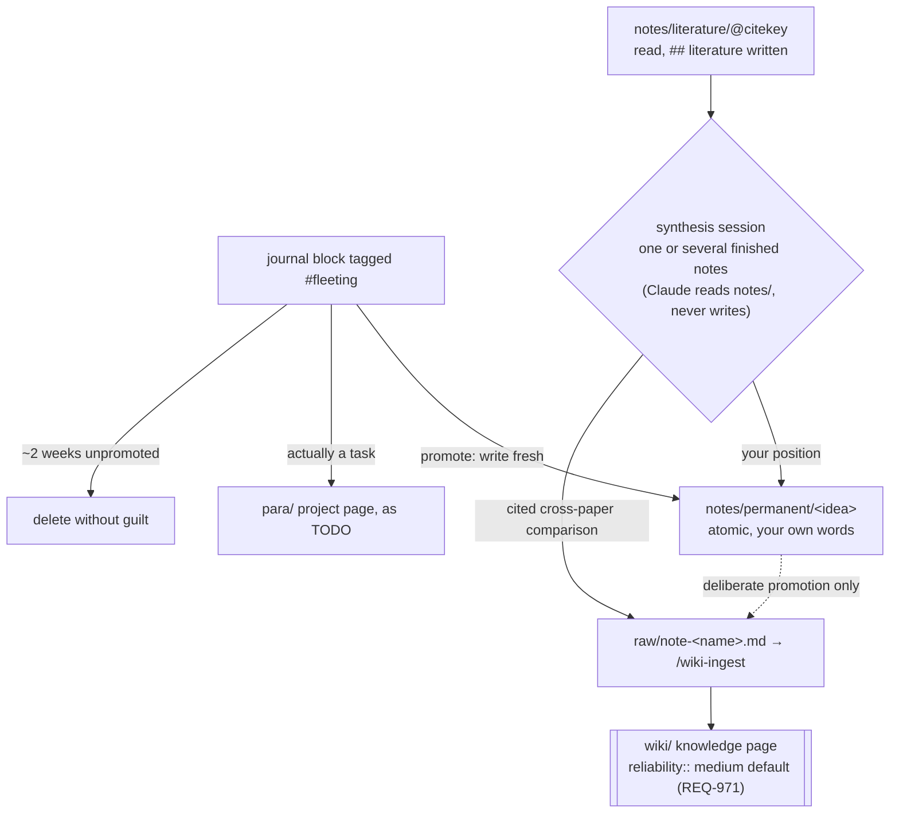

# PARA + Zettelkasten in the same graph as the wiki

How to run a PARA task/project layer (`para/`) and a Zettelkasten note layer (`notes/`) in the
same graph as your machine-written `wiki/`, without the two ever colliding.

> **Status (v2.2, 2026-07-04).** The conventions in this guide shipped in v2.2: the namespace
> contract, the promotion seam in `/wiki-ingest` (namespaces REQ-970..973), the opt-in scaffold
> (`init_wiki.py --with-para-notes`), and the Roam task-marker conversion in the migration pass.
> The pre-archive secret gate with `sensitive_source_types` shipped earlier (#15). The query
> pages and the manual archive procedure below are maintainer-verified items tracked in
> [#27](https://github.com/larnsce/llm-wiki/issues/27).

> **Scope.** This is a **vault-side workflow guide**, not a skill reference. The wiki
> toolchain does not manage `para/` or `notes/` - by design (see
> [`openspec/specs/namespaces.md`](../openspec/specs/namespaces.md)) it never writes to them (sole
> enumerated exception: the human-confirmed literature-note `source-file::` write, REQ-974). The
> pages, queries, and task markers below are things **you** create and maintain in Logseq/Obsidian
> (the opt-in scaffold only creates the directories, the seed schema pages, and a project-page
> template seed; after that they are yours). The tool's only involvement is the promotion seam at the end: durable content you
> deliberately copy into `raw/` and run through `/wiki-ingest`.

## The namespace contract

| Namespace | Owner | What lives there | Tool touches it? |
|---|---|---|---|
| `wiki/` | machine (via the wiki skills) | source-backed, synthesized knowledge | writes, lints, audits |
| `para/` | you | tasks, projects, areas, resources | **never** (may read for context) |
| `notes/` | you | fleeting / literature / permanent notes | **never** (may read for context) |
| `glossary/` | you (decisions) | EN-DE terminology decisions | scaffolds, structure-lints, reads as drafting context; writes only rows you confirm (see [glossary workflow](glossary-workflow.md)) |

The only path from `para/`/`notes/` into `wiki/` is through `raw/` (namespaces REQ-970): the same
door every external source uses, so promoted content gets the same lifecycle and provenance
(`source-file::`, per-claim `cite::`, `reliability::`; REQ-972). The promotion seam is a
`/wiki-ingest` step, not a separate command: the `raw/para-<project>.md` / `raw/note-<name>.md`
filename marks the source as promoted, and it enters at `reliability:: medium` (the
personal-synthesis case, schema REQ-586; seam default per REQ-971) unless external citations
justify higher. The wiki never silently absorbs your claims.

## Naming

Structure is **lowercase-hyphenated**; proper nouns keep their natural casing.

- **Structural segments** (namespaces, note types, workflow pages, properties): all lowercase,
  hyphen `-` (U+002D) between words, no spaces. `para/`, `notes/`, `live-list`, `fleeting-inbox`,
  `type::`.
- **Proper-noun leaves** (people, tools, papers, citekeys): written as the world writes them.
  `[[Claude Code]]`, `notes/literature/@Forte2022`.
- Hyphen `-` only — never en dash `–` (U+2013) or em dash `—` (U+2014) in page names; they are
  invisible grep traps. No underscores in structural names.

---

## `para/` — the PARA layer

### Layout

```
para/projects/<project-name>     one page per active project, tasks as blocks
para/areas/<area-name>           ongoing responsibilities
para/resources/<topic>           reference material by interest
para/archives/<project-name>     completed/inactive projects
```

`init_wiki.py --with-para-notes` (or `setup.sh --init --with-para-notes`) scaffolds these
directories, the `notes/` layout, seed `para/schema` / `notes/schema` pages, and a project-page
template seed. The scaffold is opt-in and one-time; the pages it seeds are human-editable
references, not tool-managed files.

### Conventions

The seed `para/schema` page records these (create it yourself if you skipped the scaffold; the
tool does not read it):

- Human-authored. No `source-file::`, no citations, no `reliability::`.
- Tasks are native Logseq markers — `TODO` / `DOING` / `NOW` / `DONE` / `CANCELED` — on blocks
  inside the owning project or area page.
- Every project page starts with:
  - `type:: project`
  - `status:: active | paused | archived`
  - `outcome::` — one line: what "done" looks like.
- Link freely into `[[wiki/...]]` and `[[notes/...]]`. That is the whole point of one graph.
- **Optional GitHub task-state sync** ([tasks-sync workflow](tasks-sync-workflow.md),
  `specs/tasks-sync.md`): add a `repo:: owner/repo` page property to route the project's tasks
  to that repo's issues. tasks-sync is the one sanctioned machine writer in `para/` (namespaces
  REQ-969, the exception to "never" in the contract table above) and only ever stamps
  `issue::`/`opened::`/`closed::` properties and flips a marker to `DONE` when its issue closes.

`para/resources/` is a waiting room, not a destination: anything source-backed and stable belongs
in `wiki/` (as a proper page, or a `canonical-url::` stub if it lives elsewhere — see
[`docs/literature-research.md`](literature-research.md)); anything that is your own thinking belongs
in `notes/`.

### The project template (scaffolded, then yours)

The scaffold seeds a project-page template so a new `para/projects/` page starts with exactly the
skeleton above (`type:: project`, `status:: active`, an empty `outcome::`, and a `## tasks`
section) instead of being retyped each time. Like the schema seeds, it is created once and never
touched by the toolchain again; edit it freely and add your own templates beside it (an area
template, a journal template, whatever your practice settles on - those stay vault-side by
design).

- **Logseq**: the `para/templates` page carries a native template block named `para-project`.
  On a new project page, type `/Template` on the first empty block and pick `para-project`; the
  inserted property block becomes the page properties. Add `repo:: owner/repo` to it if the
  project's tasks should sync to GitHub issues (tasks-sync, above).
- **Obsidian**: the skeleton lives at `para/templates/project.md`. Point the core Templates
  plugin's folder setting at `para/templates/`, or copy the file by hand.

If you skipped the scaffold, create the template yourself from the skeleton above; the tool does
not read it.

### Roam → Logseq task conversion (one-time, on import)

If you are importing PARA pages from a Roam export, the task markers arrive as `{{[[TODO]]}}` /
`{{[[DONE]]}}` and need converting to Logseq's bare markers. **Do this through the migration
pass** (`migrate_wiki.py --lowercase`, driven interactively by `/wiki-migrate`), not a hand-run
`sed`; the v2 tooling deliberately carries no `sed`. The pass converts `{{[[TODO]]}}` → `TODO`
and the `DOING` / `DONE` / `NOW` / `LATER` / `WAITING` / `CANCELED` variants alongside its
lowercase renames, and it is dry-run by default and idempotent. After the pass, spot-check for:

- Stray block references `((...))`: resolve them to plain text or real `[[links]]`.

### The Live List (a query page you own)

Create `para/live-list` as a **view** — never edit tasks here; edit them on their project page.

**Logseq** (`para___live-list.md`):

```
type:: query-page

- ## live list
	- All NOW/DOING tasks across active projects. This page is a VIEW.
	- #+BEGIN_QUERY
	  {:title "now / doing"
	   :query [:find (pull ?b [*])
	           :where
	           [?b :block/marker ?m]
	           [(contains? #{"NOW" "DOING"} ?m)]
	           [?b :block/page ?p]
	           [?p :block/name ?name]
	           [(clojure.string/starts-with? ?name "para/projects/")]]
	   :group-by-page? true
	   :breadcrumb-show? true}
	  #+END_QUERY
	- #+BEGIN_QUERY
	  {:title "next up (TODO)"
	   :query [:find (pull ?b [*])
	           :where
	           [?b :block/marker "TODO"]
	           [?b :block/page ?p]
	           [?p :block/name ?name]
	           [(clojure.string/starts-with? ?name "para/projects/")]]
	   :group-by-page? true}
	  #+END_QUERY
```

**Obsidian** — Logseq's `#+BEGIN_QUERY` Datalog is Logseq-only. This page (and the fleeting inbox
below) are **Logseq tier-1**. On Obsidian, reproduce them with the community **Dataview** plugin
(a `dataview` task query filtering on the `para/projects/` folder). It is not part of core and is
not maintained by this project — treat it as experimental.

### Archiving a project (a manual procedure)

There is no `/para archive` command — this is a deliberate choice (the tool stays a wiki tool). Run
it by hand:

1. **Gate.** Confirm every task block on `para/projects/<project>` is `DONE` or `CANCELED`. If not,
   finish or cancel the open ones first.
2. **Distill.** Write a ≤10-line outcome summary (what was done, what was learned, links touched)
   under a `## outcome` heading on the page.
3. **Harvest (optional).** Ask yourself: does this project hold knowledge the `wiki/` should keep?
   If yes, copy the durable blocks + the outcome summary verbatim into `raw/para-<project>.md` and
   run `/wiki-ingest`; the filename marks it as a promoted source (namespaces REQ-970). It enters
   at `reliability:: medium` (personal synthesis, schema REQ-586 / namespaces REQ-971) unless it
   carries external citations that justify higher.
4. **Move.** Rename `para/projects/<project>` → `para/archives/<project>`; set `status:: archived`
   and `archived:: <date>`.

---

## `notes/` — the Zettelkasten layer

### Conventions

The seed `notes/schema` page records these (create it yourself if you skipped the scaffold):

- Human-written, always. If Claude drafts it, it is not a note — it is a `wiki/` page. The writing
  IS the thinking; do not delegate it.
- One `type::` property per page: `fleeting | literature | permanent`. Properties, not tags, carry
  the note type — queries filter on them.
- Layout:
  - **fleeting** → NOT pages. Journal blocks tagged `#fleeting`.
  - **literature** → `notes/literature/@<citekey>` (born from Zotero; see
    [`docs/zotero-setup.md`](zotero-setup.md)). Carries `source-file::` pointing at the SAME
    `ingested/...` path the wiki pages cite. One archived source, two readings (namespaces
    REQ-973; when ingest recognizes a literature note it offers to set the property and writes
    it on your confirmation - the one sanctioned write into `notes/`, REQ-974).
  - **permanent** → `notes/permanent/<idea-in-a-few-words>`. Atomic: one idea, your own words,
    densely linked to other `[[notes/...]]` and `[[wiki/...]]` pages.
- **Promotion is an act of writing, not a rename:**
  - fleeting → permanent: write the permanent note fresh, link the journal block to it, remove
    `#fleeting` (or mark the block `DONE`).
  - fleeting → task: move it to the owning `para/` page as a `TODO`.
  - Anything not promoted within ~2 weeks: delete without guilt.
- **notes → wiki (deliberate only):** copy the note into `raw/note-<name>.md` and run
  `/wiki-ingest`; the filename marks it as a promoted source (namespaces REQ-970). It arrives at
  `reliability:: medium` (schema REQ-586 / namespaces REQ-971) with the standard lifecycle,
  provenance, and per-claim citations (REQ-972).

### What each type looks like

The `type::` property only exists on **pages**, so a fleeting note never carries one - it is a
journal block, and the `#fleeting` tag (added by hand) is its whole markup:

```markdown
- properties beat tags for note types - is that why the schema queries filter on type::? #fleeting
```

A **permanent** note is a page under `notes/permanent/`, one `type::` property, one idea, densely
linked (`pages/notes___permanent___properties-beat-tags.md`):

```markdown
type:: permanent

- Properties beat tags for note types
	- A `type::` property holds exactly one value per page, so a query can filter on it like a
	  column. Tags accumulate and carry no constraint - good for workflow states (`#fleeting`),
	  wrong for classification.
	- Sparked by [[notes/literature/@Forte2022]]; the wiki side makes the same choice in
	  [[wiki/architecture]].
```

A **literature** note is a page under `notes/literature/@<citekey>` with `type:: literature` in
the template `/lit-sync` writes - see [`docs/zotero-setup.md`](zotero-setup.md) for the full
template and the working loop.

### From literature note to synthesis (the step after reading)

Finishing a paper is not the end of the loop. Synced annotations and a written `## literature`
section make the literature note *complete*; they do not yet make it *useful*. The step that pays
for the reading is deliberate: sit down with the finished note - or several - and write synthesis.
There is no command for this, on purpose (the writing IS the thinking); what follows is the manual
procedure, with two possible outputs depending on what the synthesis is.

**One paper, one idea that outgrew it → a permanent note.**

The default output. When a literature note holds an idea you keep coming back to, write it as
`notes/permanent/<idea-in-a-few-words>`: atomic, your own words, linking back to
`[[notes/literature/@citekey]]` and to any other `[[notes/...]]` or `[[wiki/...]]` pages it
touches. This is step 5 of the [Zotero working loop](zotero-setup.md) - the permanent note is
where the idea stops belonging to the paper and starts belonging to you.

**Several papers, one question → synthesize across them.**

Nothing restricts a synthesis session to one paper; the sessions that earn their keep usually put
three or four finished literature notes on the table at once. The namespace contract forbids tool
*writes* into `notes/`, not reads, so Claude can sit in the session as a sparring partner:

1. Pick the finished notes (papers read, `## literature` written).
2. Ask Claude to read the `notes/literature/@...` pages side by side: where do they agree, where
   do they disagree, what does none of them answer?
3. Argue with what comes back, then route the output by what it is:
   - **Your position** ("X and Y disagree on Z; I side with Y because...") → write it yourself as
     a permanent note. Claude probes and challenges; it does not draft the note - human-written
     is what makes it a note (see the conventions above).
   - **Source-backed comparison you will want to query later** → that is `wiki/` material: put it
     in `raw/note-<name>.md` and run `/wiki-ingest` as a `knowledge` page that links down to the
     existing `wiki/` paper pages, the same pattern as ingesting an Elicit review (see
     [Literature Research](literature-research.md)). It enters at `reliability:: medium` as
     personal synthesis unless its citations justify higher (REQ-971).

The routing test is the one from [Literature Research](literature-research.md): if the output only
makes sense as *your* thinking, it is a permanent note; if future-you will `/wiki-query` for it
and want a cited answer, it is a wiki page. A good session often produces one of each - the
permanent note holding the position, the wiki page holding the evidence, each linking to the
other.

The whole `notes/` lifecycle, with this synthesis fork on the right:



### Querying on `type::`

Because the type is a property, one simple query per type is enough (put these on any page you
own, e.g. a `notes/index` page):

```markdown
- {{query (property type permanent)}}
- {{query (property type literature)}}
```

Fleeting notes are queried by tag, not property - that is exactly the fleeting-inbox query below.
An advanced-query example: literature notes whose `source-file::` is still blank, i.e. papers
annotated in Zotero but not yet through the ingest pipeline:

```
#+BEGIN_QUERY
{:title "literature notes not yet through the pipeline"
 :query [:find (pull ?p [*])
         :where
         [?p :block/name ?name]
         [(clojure.string/starts-with? ?name "notes/literature/")]
         [?p :block/properties ?props]
         [(get ?props :source-file "") ?sf]
         [(= ?sf "")]]}
#+END_QUERY
```

These are Logseq tier-1 like the query pages below (namespaces REQ-977); on Obsidian, reproduce
them with Dataview (experimental, not maintained by this project).

### The fleeting inbox (a query page you own)

Create `notes/fleeting-inbox` (Logseq tier-1; Dataview on Obsidian as above):

```
type:: query-page

- ## fleeting inbox
	- Unprocessed #fleeting blocks from the journal. Process = promote or delete. Aim for empty.
	- #+BEGIN_QUERY
	  {:title "unprocessed fleeting notes"
	   :query [:find (pull ?b [*])
	           :where
	           [?b :block/refs ?r]
	           [?r :block/name "fleeting"]
	           [?b :block/page ?p]
	           [?p :block/journal? true]
	           (not [?b :block/marker "DONE"])]
	   :breadcrumb-show? true}
	  #+END_QUERY
```

A processed fleeting block is either deleted or marked `DONE` with a link to where it went.

---

## A note on personal data

Promoted `para/`/`notes/` sources go through `raw/` and are normally committed verbatim into
`ingested/` (git history). The pre-archive secret gate (shipped in #15, ingest REQ-045) scans
every source's bytes before the move. If your notes can carry governed personal data, list
`notes` (and/or `para`) under `sensitive_source_types` in `llm-wiki.yml` (namespaces REQ-981,
ingest REQ-046): the file is still archived into `ingested/` but never staged, so its bytes stay
out of git history. See the schema/ingest specs for the "`ingested/` is committed history, keep
it secret-free" invariant.

## Related

- [`openspec/specs/namespaces.md`](../openspec/specs/namespaces.md) — the normative contract
- [Zotero setup](zotero-setup.md) — how literature notes are born as `notes/literature/@citekey`
- [Literature Research](literature-research.md) — the discovery→Zotero→ingest funnel
- [Schema Reference](schema-reference.md) — naming, reliability, provenance
