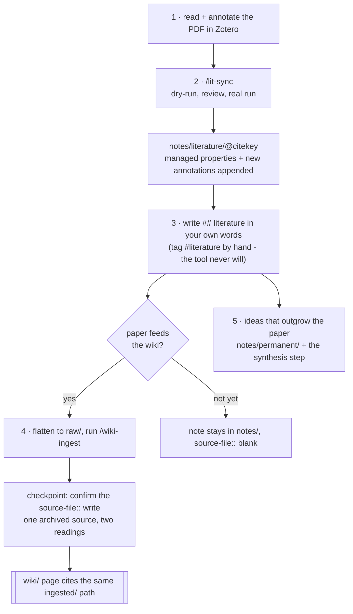

# Zotero → `notes/literature/@citekey`

How to wire Zotero into the graph so literature notes are born in the right namespace with the
right properties, and stay auditable against the same archived source the `wiki/` pages cite.

> **Status (2026-07-07).** The logseq-zoterolocal-plugin recommended by earlier versions of
> this guide **did not work in practice; the plugin approach is abandoned** (issue
> [#90](https://github.com/larnsce/llm-wiki/issues/90)). Replacement: `scripts/lit_sync.py`
> against Zotero's local HTTP API, driven by the `/lit-sync` command. The schema side is
> unchanged from v2.2 (the `@citekey` proper-noun leaf, namespaces REQ-976, the
> literature-variant seam in `/wiki-ingest`, REQ-973/974). The end-to-end loop run with the
> script is the remaining maintainer-verified item, tracked in
> [#28](https://github.com/larnsce/llm-wiki/issues/28).

> **Verify before you trust this.** The local API endpoint and behavior below are written
> against **Zotero 9** (the local API arrived in Zotero 7 and is unchanged through current
> releases: API v3 only, same endpoint, same enable switch). After each end-to-end loop run,
> stamp this doc with the Zotero version it was verified on, so the metadata your provenance
> rests on does not shift under you. Not yet verified end-to-end; #28 tracks the first run.

## Where this fits

Zotero is your **citation source of truth** (see [Literature Research](literature-research.md)).
This guide covers the last mile: getting a Zotero item into Logseq as a
`notes/literature/@<citekey>` page that (1) holds your reading in your own words and (2) points at
the same `ingested/...` source the wiki cites. The `## literature` block is a **`notes/` page**:
human-written, machine-exempt (see [`namespaces.md`](../openspec/specs/namespaces.md)). It is not a
`wiki/` page and the wiki skills never edit it.

## The sync script

**`scripts/lit_sync.py`**, run via the **`/lit-sync`** command. It talks to Zotero's **local
HTTP API** (`http://localhost:23119/api/users/0`, Zotero 7+, API v3): no Logseq plugin, no
Zotero cloud API, no BBT export file.

- **Idempotent metadata:** each run rewrites only the managed properties (`type`, `citekey`,
  `authors`, `year`, `item-type`, `doi`, `zotero`); `source-file::` and any user-added
  properties are preserved.
- **Incremental annotation sync:** annotations are read as children of the PDF attachments,
  sorted by position in the PDF, and only annotations with a Zotero version newer than the
  page's `zotero-last-sync::` stamp are appended; the stamp is then updated from the library
  version. Re-syncing never clobbers your prose; the reading section (`## literature`; `## my reading` on pages created before the #101 rename) is never touched.
- **Skips items without a citekey, with a warning:** the citekey is read from Zotero's native
  citation-key field (`citationKey`, kept filled by Better BibTeX's *Automatically fill
  citation key after* setting; this field replaces the old `Citation Key: xxx` line in
  `extra`), with a fallback to `extra` for libraries BBT has not migrated yet. Nothing is
  guessed.

(Obsidian users: the **Zotero Integration** plugin remains the equivalent there. This guide is
written for the Logseq script; the property template idea transfers.)

### One-time setup

1. Zotero → **Settings → Advanced** → check *Allow other applications on this computer to
   communicate with Zotero* (the local API returns 403 without it).
2. Install **Better BibTeX** and configure its **Citation keys** section: citation key formula
   `auth.lower + year + veryshorttitle(1, 0).lower`, *Automatically fill citation key after* set
   to `2` seconds, *Regenerate citation key when item changes* left unchecked (a filled key must
   not change once its page exists). Filling writes the key into Zotero's native citation-key
   field, which syncs across devices. Earlier versions of this guide talked about "pinning";
   Better BibTeX renamed that to "filling", so the old *Automatically pin citation key after*
   setting is today's *Automatically fill citation key after*.
3. Optional, but part of the standard setup here: in **Settings → Export**, set Quick Copy's
   *Item Format* to *Better BibTeX Citation Key Quick Copy* and *Note Format* to
   *Markdown + Rich Text* with *Include Zotero Links* checked for Markdown. Cmd+Shift+C then
   copies a selected item's citekey for linking `[[notes/literature/@<citekey>]]` while you
   write. The sync script itself does not need this.

The [walkthrough](zotero-setup-walkthrough.md) covers the same setup click by click, including
installing Zotero and Better BibTeX from scratch.

### Running it

```
python3 scripts/lit_sync.py --vault <logseq-graph-root> --dry-run   # review first
python3 scripts/lit_sync.py --vault <logseq-graph-root>            # then for real
```

Or run `/lit-sync`, which wraps exactly this (dry-run, review, real run, commit). If the local
connection fails, **stop**: fix the Zotero side; do not work around it with the cloud API.

## Page name and file

Every synced item gets the page `notes/literature/@<citekey>`, e.g.
`notes/literature/@forte2022building` - the zoteroRoam-style `@` leaf (lint recognizes it as a
proper-noun leaf; see [`namespaces.md`](../openspec/specs/namespaces.md) REQ-976). On disk the
script matches the vault's existing namespace-filename encoding (`___` by default, `%2F` if the
vault already uses it), so e.g. `pages/notes___literature___@forte2022building.md`.

## Page template

The script writes this template on creation - full metadata is noise; the raw source lives in
`ingested/` anyway:

```markdown
type:: literature
citekey:: forte2022building
authors:: Tiago Forte
year:: 2022
item-type:: book
doi::
zotero:: zotero://select/library/items/<KEY>
source-file::
zotero-last-sync:: <library version>

- ## literature
	-
- ## annotations
	- (synced from Zotero below this line)
```

- `source-file::` is left blank by the template. It gets filled **when the paper goes through the
  pipeline**, pointing at `ingested/papers/<file>.md` - the same path the machine-written `wiki/`
  page cites. That shared path is the seam that makes your interpretation auditable against the
  same source as the wiki's ("one archived source, two readings", namespaces REQ-973). When
  `/wiki-ingest` recognizes a promoted literature note (a `raw/note-@<citekey>.md` filename, or
  `citekey::` / `type:: literature` metadata) and this page exists with the property still blank,
  it offers at the checkpoint to set it to the `ingested/` path it produced - you confirm, the
  tool types (REQ-974, issue #133). This is the one sanctioned tool write into `notes/`; it never
  creates the page, never overwrites a value you set, and in `--auto` runs it only reminds.
- `## literature` is yours: your literature note in the Zettelkasten sense (add the `#literature` tag by hand when you write it; the tooling never writes tags). Annotation sync appends under its own blocks and never touches your
  prose.

## The working loop

1. Read + annotate the PDF in Zotero.
2. Run `/lit-sync` (dry-run first, then real): new items get their `@citekey` page, new
   annotations append under `## annotations`.
3. Write `## literature` in your own words - this is the literature note (tag it `#literature` yourself).
4. When the paper feeds the wiki: export/flatten to markdown into `raw/`, run `/wiki-ingest`, and
   confirm at the checkpoint when it offers to set `source-file::` here to the `ingested/` path it
   produced (REQ-973/974) - the tool writes the path for you.
5. Ideas that outgrow the paper get their own `notes/permanent/` page, linking back to
   `[[notes/literature/@citekey]]`. Finished notes - one or several at once - then feed the
   deliberate synthesis step (permanent note for your position, wiki `knowledge` page for the
   cited cross-paper comparison); the procedure is in the
   [PARA + Zettelkasten workflow](para-notes-workflow.md) under "From literature note to
   synthesis".



## iPad / iOS (reading and annotating)

The iPad is a **reading device** in this loop: read and highlight PDFs in the Zotero iOS app.
Importing, citekeys, and `/lit-sync` all stay on the desktop.

- **Setup on the iPad:** install Zotero from the App Store and sign in with your zotero.org
  account. That is all. There are no API keys to create (the app authenticates itself; "API
  keys" only exist for third-party tools on the *web* API, which this setup does not use), no
  plugins (Better BibTeX does not exist on iOS), and no citation-key settings (keys live in
  Zotero's native, syncing citation-key field, assigned by BBT on the desktop).
- **Prerequisite on the desktop:** turn on Zotero sync (**Settings → Sync** → sign in). Data
  sync is free and unlimited; reading PDFs on the iPad additionally needs **file syncing**
  (attachments as stored copies, not linked files) via Zotero Storage (300 MB free, paid tiers)
  or WebDAV. Zotero Storage is the simplest choice and the default recommendation.
- **Scope of the cloud:** this syncs your Zotero *library between your own devices*. It changes
  nothing about the sync into Logseq: `lit_sync.py` still talks only to the desktop's local API
  and never the cloud API (issue #90, decision 1).
- **The loop with an iPad:** highlight on the iPad → it syncs to zotero.org → desktop Zotero
  pulls it down → run `/lit-sync` on the desktop as usual. Synced annotations carry new Zotero
  version numbers, so the incremental `zotero-last-sync::` logic picks them up like any
  desktop-made highlight.
- Items saved on the iPad get their citekey the next time desktop Zotero (with BBT) syncs;
  until then `/lit-sync` skips them with a warning. If you import on the desktop only, this
  never comes up.
- The `## literature` prose is written in Logseq, not on the iPad; setting up Logseq mobile is a
  separate concern, out of scope here.

> Written against the current Zotero iOS release (2026-07); not yet verified end-to-end - fold
> that into the #28 verification run (annotate one paper on the iPad and confirm `/lit-sync`
> picks the highlight up on the desktop).

## Citation-graph gap

No Logseq plugin replicates zoteroRoam's citation-network browsing (Scite / Connected Papers).
Cover it with the Semantic Scholar MCP already documented in
[Literature Research](literature-research.md): citation-walk on demand, results entering through
`raw/` like everything else.

## Related

- [Zotero setup walkthrough](zotero-setup-walkthrough.md) - the novice-friendly step-by-step
  install, including Quick Copy and the #28 verification run
- [Literature Research](literature-research.md) - the full discovery→Zotero→ingest funnel and the
  Semantic Scholar MCP setup
- [PARA + Zettelkasten workflow](para-notes-workflow.md) - the `notes/` layer this feeds
- [`openspec/specs/namespaces.md`](../openspec/specs/namespaces.md) - the namespace contract
